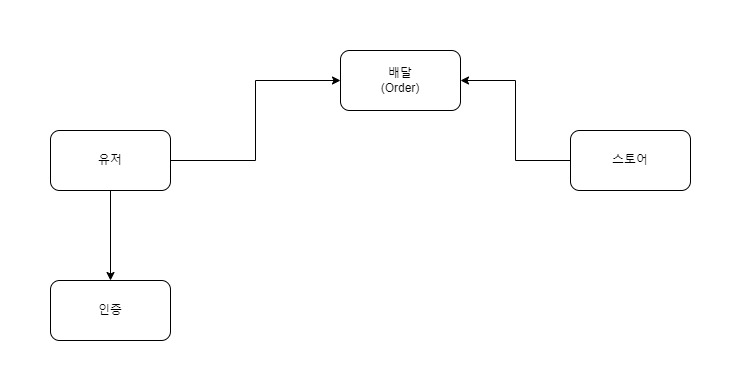

## 요구사항 목록 정리

1. 회원가입 API 구현
   - 필요한 정보 : ID, PW, name
   - 대문자, 소문자, 숫자, 특수문자 중 3종류 이상 12자리 이상 문자열

2. 로그인 API 구현
   - IN : ID, PW
   - OUT : ACCESS TOKEN

3. 배달 조회 API 구현
   - 조회 시 필요한 정보 : 기간 (최대 3일)
   - 기간 내 사용자가 주문한 배달 목록 제공

4. 배달 주문 수정 API 구현
   - 도착지 주소 변경 요청
   - 변경 가능한 배달인 경우에만 수정이 가능

### 기타

1. DB 사용
2. MVC 기반 App 설계
3. 예외 케이스 AMAP
4. JWT 적용
5. Test Case 작성
6. API 명세서

---

# 참고사항
- docker-compose.yml을 통해 test db(h2) 와 dev db(mysql)를 연동하고 있습니다.

---

# 도메인 설계 예상도

---

# 포스트맨 테스트

- /postman 안 파일에서 postman json 파일들을 받으신 다음 import를 이용해 기능 테스트를 하실 수 있습니다.
